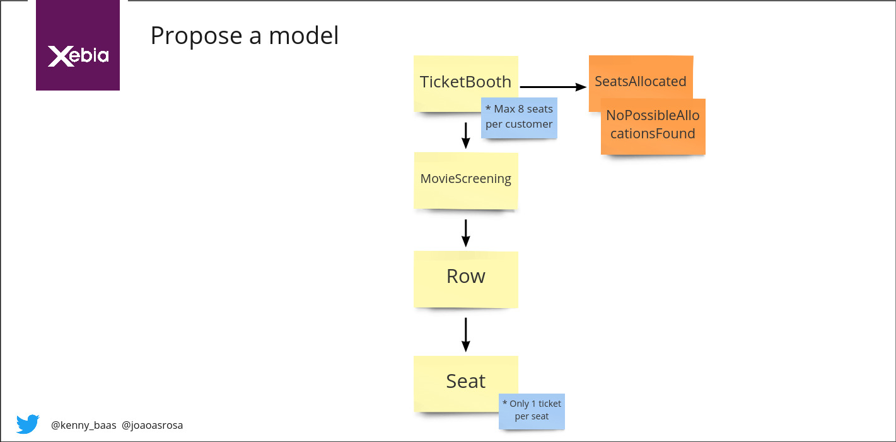

# Workshop: Designing bounded contexts for microservices by coding outside-in TDD

There is an industry trend where businesses are moving towards autonomous product teams. These teams aim to be end-to-end responsible for the product they are building and maintaining. With the help of Continuous Delivery, teams have faster feedback cycles in which they can probe if a feature work. To achieve end-to-end team autonomy, companies move towards a microservices architecture to successfully inspect and adapt. To be successful with a microservices architecture, we need to use the Domain-driven design bounded context pattern. However, only by implementing a bounded context in code, we can experience if the model is useful.

In this session, we take you on a journey, where we explain how we implemented a complex software system within a bounded context. We start coding to explore and quickly iterate over our naive domain model with outside-in Test-Driven Development (TDD). With outside-in TDD, we grow our model guided by coarse-grain tests without the need of using mocks inside our domain. We eventually leverage the ports and adapter architecture to keep our domain model protected from technical complexity. In the end, we will demonstrate an example of how to split your domain model towards microservices.

## Speakers

### João Rosa

João is a Strategic Software Delivery Consultant at Xebia. He focuses on helping teams and organizations to make strategic decisions regarding the software; aligning teams and software to optimize the stream-based value. He believes in the power of collaboration and is a fan of visual collaboration tools.

When he is not on his duties, you can find him travelling with his daughter and wife, or laying down on the beach reading a book. João is an amateur cook in his remaining time.

[@joaoasrosa](https://www.twitter.com/joaoasrosa)

### Kenny Baas-Schwegler

A lot of knowledge is lost when designing and building software — lost because of hand-overs in a telephone game, confusing communication by not having a shared language, discussing complexity without visualisation and by not leveraging the full potential and wisdom of the people. That lost knowledge impacts the quality and value of the software product being build. By leveraging Deep Democracy, Domain-Driven Design, Continuous Delivery and visual collaborate tools, Kenny Baas-Schwegler empowers organisations, teams and people in building valuable quality software products.

One of my core principles is sharing knowledge. I do that by blogging on my website baasie.com I also organise several meetups like Virtual Domain-Driven Design, Domain Driven Design Nederland, and I am a public speaker giving talks and hands-on workshops at conferences and meetups. 

[@kenny_baas](https://www.twitter.com/kenny_baas)

## Workshop

### Requirements

#### C#

.net core 2.1 or higher

#### java

Java 8 or higher
Maven
Lombok plugin

#### Others

You can take the Java or C# code as an inspiration to start for yourselves.

### Exercise

Start on main branch by implementing the tests `TicketBoothShould` by doing outside-in TDD. We already setup most scaffolding with an aenemic Domain Model to help you. You can find the stubs for the MovieScreening state at `Stubs/`. In Stubs you can create your own examples by following the json schema that is already there. It all comes down to the `showId` that is being used in the tests.

We use the following naive first design of our model to implement with outside-in TDD:

